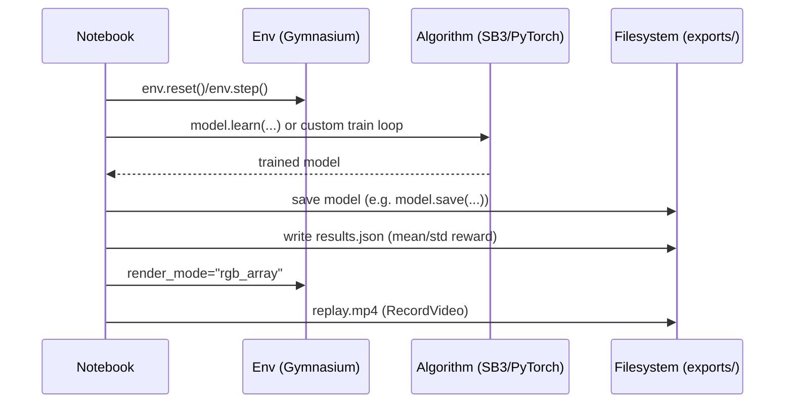

# Architecture Overview

This repository contains the Hugging Face **Deep Reinforcement Learning Course** content (MDX) and the **hands-on notebooks** (plus some standalone scripts and saved artifacts).

## System Summary

- **Primary goal**: teach RL theory + provide runnable hands-on exercises (Q-learning → DQN → Policy Gradient → Actor-Critic/PPO/A2C…).
- **Two “products” in one repo**:
  - **Course website content**: `units/en/**/*.mdx`
  - **Runnable code & experiments**: `notebooks/unit*/` (Jupyter notebooks + helper scripts + generated outputs)

**Tech stack (runtime):**
- **Python** (conda env mentioned as `deep-rl-class`)
- **Gymnasium** environments
- **Stable-Baselines3** for deep RL baselines (PPO/A2C/etc.)
- **PyTorch** in some units (e.g. REINFORCE / custom models)

## High-Level Architecture

```mermaid
graph TB
  Learner[Student / Researcher] --> NB[notebooks/unit*/unit*.ipynb]
  NB --> ENV[Gymnasium Environments]
  NB --> ALG[Algorithms]
  ALG -->|SB3| SB3[stable-baselines3]
  ALG -->|Custom| PT[PyTorch custom impl]
  NB --> UTIL[notebooks/utils.py]
  NB --> OUT[notebooks/unit*/exports/ + logs/ + *.zip/*.mp4/*.json]
  Content[units/en/**/*.mdx] --> Site[Course website build (external)]
```

## Project Structure (What lives where)

```text
deep-rl-class/
├── README.md                     # Course entry point + links
├── notebooks/
│   ├── utils.py                  # Shared helpers (save/evaluate/record video)
│   ├── unit0/                    # Tabular RL + helper scripts (FrozenLake)
│   ├── unit1/                    # SB3 PPO LunarLander + exports/
│   ├── unit2/                    # Q-learning (FrozenLake/Taxi) + exports/
│   ├── unit3/                    # DQN + RL Zoo configs/logs
│   ├── unit4/                    # Policy Gradient (REINFORCE) + exports/
│   ├── unit6/                    # Actor-Critic (A2C) + vecnormalize + exports/
│   └── unit8/                    # PPO + advanced topics notebooks
└── units/
    └── en/
        ├── unit*/                # Course text (MDX) per unit
        ├── cart_pole/            # Standalone CartPole DQN project (scripts + weights)
        └── car_racing/           # Custom environment wrappers/scripts
```

## Key Entry Points

### Notebooks (hands-on)
- **Unit 1 (SB3 PPO LunarLander)**: `notebooks/unit1/unit1.ipynb`
- **Unit 2 (Q-learning)**: `notebooks/unit2/unit2.ipynb`
- **Unit 3 (DQN / RL Zoo)**: `notebooks/unit3/unit3.ipynb`
- **Unit 4 (REINFORCE / Policy Gradient)**: `notebooks/unit4/unit4.ipynb`
- **Unit 6 (A2C / Actor-Critic)**: `notebooks/unit6/unit6.ipynb`

### Shared utility for “save/evaluate/record video”
- **`notebooks/utils.py`**
  - `save_and_evaluate(...)`: save SB3-style model + evaluate + write `results.json` + record `replay.mp4`
  - `record_video(...)`: record an MP4 replay via Gymnasium `RecordVideo`

### Standalone scripts (outside notebooks)
- **CartPole DQN mini-project**: `units/en/cart_pole/`
  - `dqn_train.py`: training
  - `test_model.py`: evaluation / rendering
  - `cart_pole_env.py`: environment wrapper

## Data / Artifact Flow



## “Edit here for X” guide

- **Change how videos are recorded / saved**: `notebooks/utils.py`
- **Unit 1 LunarLander evaluation + local export**: `notebooks/unit1/unit1.ipynb` (the “evaluate and save” cell uses `notebooks/utils.py`)
- **Unit 6 A2C save/evaluate/video**: `notebooks/unit6/unit6.ipynb` (imports `notebooks/utils.py`)
- **Fix env version issues (e.g. LunarLander-v2 deprecated)**: update notebook cells to use `LunarLander-v3`
- **CartPole DQN training logic**: `units/en/cart_pole/dqn_train.py`
- **CartPole environment wrapper**: `units/en/cart_pole/cart_pole_env.py`

## Common Gotchas / Troubleshooting

- **Gymnasium env ID/version deprecations**: Some notebooks originally referenced older IDs (e.g. `LunarLander-v2`). Prefer the latest version (e.g. `LunarLander-v3`) when Gymnasium raises `DeprecatedEnv`.
- **Hub upload failures (403)**: If you see requests going to an HF mirror endpoint (e.g. `hf-mirror.com`) you may need to switch to the official endpoint and/or use a write token.
- **Video recording**: Gymnasium generally requires `render_mode="rgb_array"` at env creation to generate frames for video recording.


